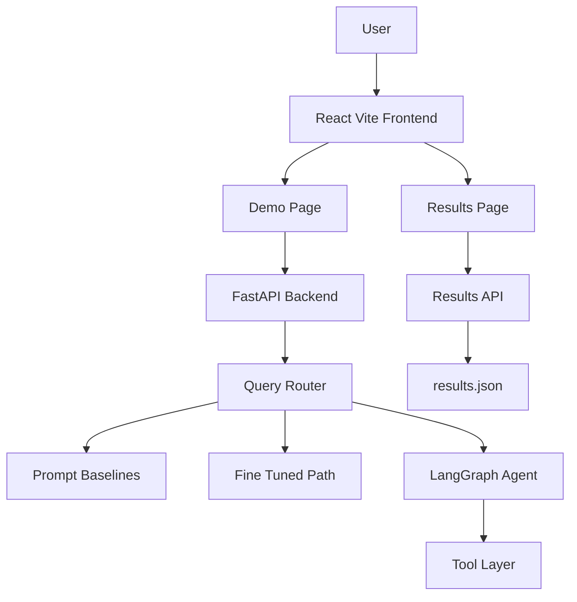
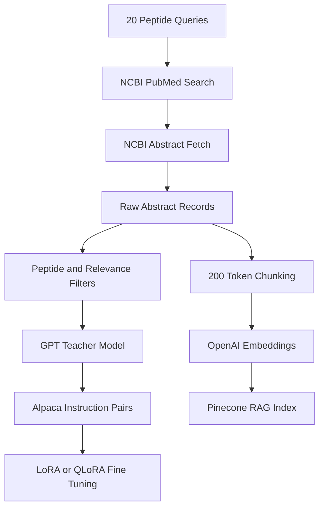
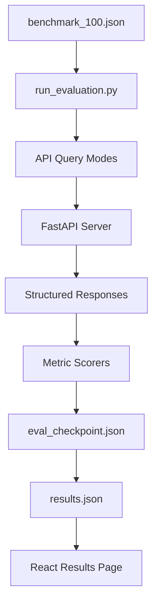
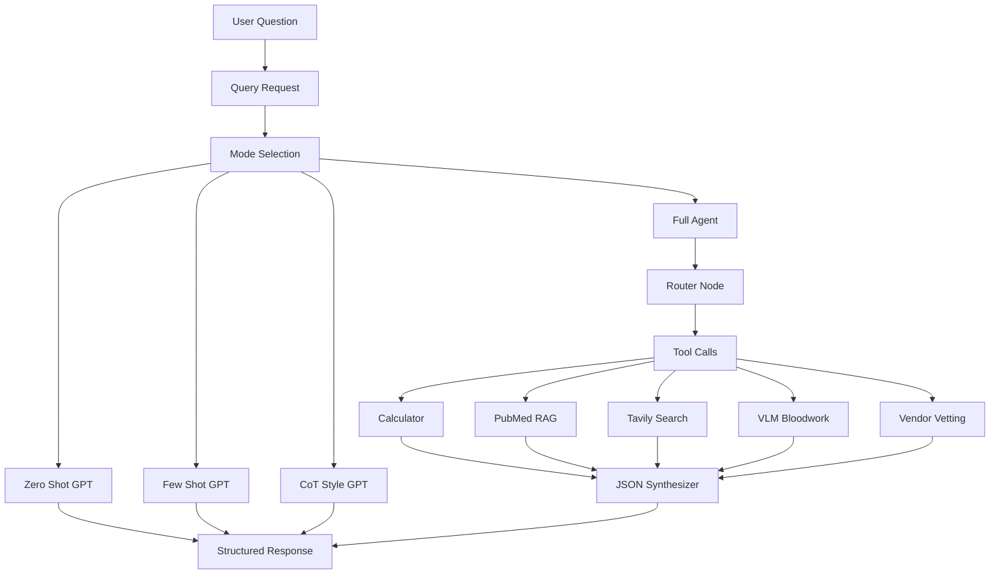
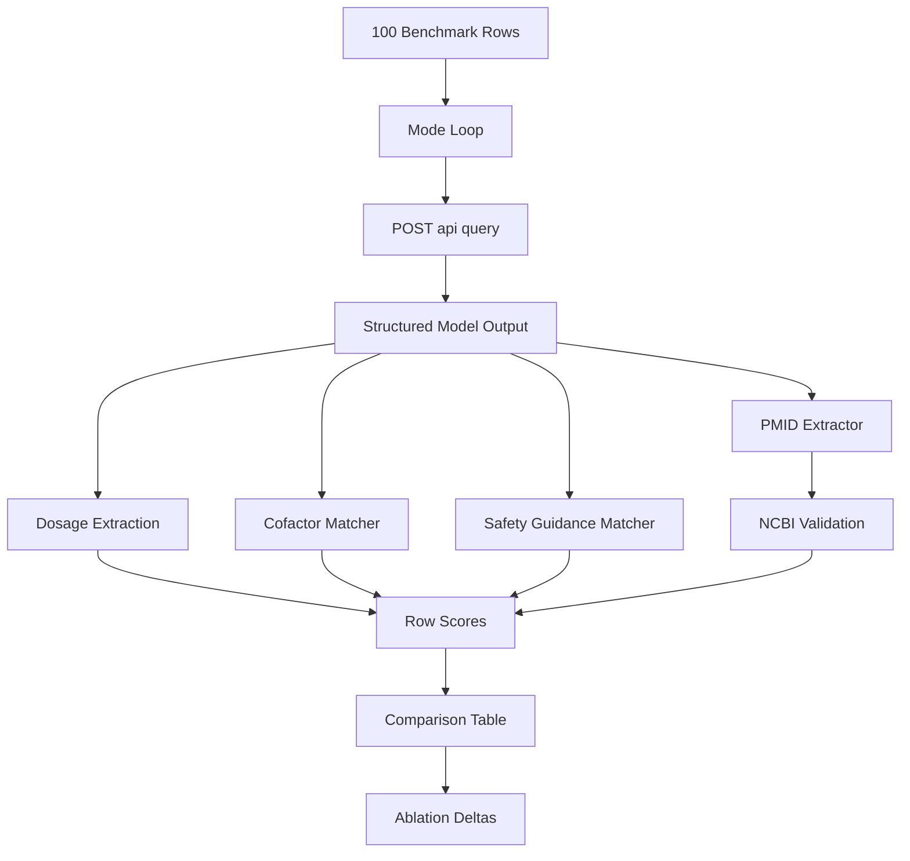

# PeptiScout AI Local Project Report

## 1. Executive Summary

PeptiScout AI is a local academic prototype for the CPS 5801 Advanced AI final project. It is an LLM/VLM-driven research assistant for peptide-related questions, including reconstitution math, mechanism-of-action summaries, safety cautions, vendor/source vetting, citation auditing, and optional bloodwork image interpretation.

The system compares several approaches required by the project:

- Prompt-only LLM baselines: zero-shot, few-shot, and chain-of-thought-style prompting.
- Lightweight fine-tuning: local notebooks and inference paths for LoRA/QLoRA peptide instruction tuning.
- Tool-based agent design: a LangGraph workflow that calls deterministic and external tools before synthesizing a structured answer.
- Quantitative evaluation and ablation: a custom 100-question benchmark with dosage, pathway/cofactor, safety, and citation/source metrics.

The local GPT-based run shows that the full agent was strongest on dosage scoring and citation accuracy. The calculator ablation indicates that deterministic math improved dosage score by about 10.3 percentage points. The local results also show an important limitation: the full agent's pathway/cofactor completeness score was lower than some simpler prompting modes, which means the agent improved tool-grounded reliability but did not always mention every gold cofactor keyword.

This report only uses the current local repository and local files. It does not assume external metrics that are not present in this directory.

## 2. Project Requirement Coverage

| CPS 5801 requirement | Local PeptiScout evidence |
| --- | --- |
| Problem definition | Peptide research QA, dosage/reconstitution math, MOA explanation, safety guidance, vendor/source review, citation audit. |
| Agent architecture | FastAPI backend, React frontend, LangGraph agent, OpenAI GPT calls, RAG, calculator, Tavily, VLM, source vetting. |
| Evaluation plan | `backend/data/benchmark_100.json`, `backend/scripts/run_evaluation.py`, `backend/data/results.json`. |
| Baseline LLM/VLM agent | Prompt-only GPT modes in `backend/routers/query.py`: zero-shot, few-shot, CoT-style. |
| Prompt engineering | Structured four-section output, few-shot examples, hidden planning-style prompt, JSON response forcing. |
| Lightweight fine-tuning | Alpaca dataset pipeline and local notebooks for LoRA/QLoRA training and evaluation. |
| Tool-based AI agent | LangGraph full-agent mode in `backend/agent/graph.py`, plus tools in `backend/tools/`. |
| Quantitative evaluation | DS, DS strict, PC, TSR, CA metrics computed by `backend/scripts/run_evaluation.py`. |
| Ablation study | No-reasoning, no-calculator, and RAG-only modes in local GPT results. |
| Discussion and conclusions | Included below: what worked, what did not work, limitations, and next steps. |

## 3. Problem Definition

### Application Scenario

PeptiScout AI is designed for educational research workflows where a user asks peptide-related questions and expects a structured, auditable answer. The system is not a medical product and does not prescribe treatment. Its purpose is to demonstrate how LLM prompting, fine-tuning, retrieval, deterministic tools, and agent orchestration perform on a realistic research-assistant task.

### Target Users

- Students working on peptide, biomedical, or AI-agent research.
- Research reviewers who want structured summaries with citations.
- Users comparing prompt-only LLM responses with tool-grounded agent responses.

### Inputs

- Natural-language peptide questions.
- Optional vial size, dose, water volume, and syringe type.
- Optional vendor/source questions.
- Optional bloodwork image, such as a lab report panel.

### Outputs

Every query mode normalizes responses into four fields:

- `protocol`: dosing, reconstitution, schedule, or practical research guidance.
- `moa`: mechanism of action at pathway level.
- `good_bad`: benefits, risks, contraindications, monitoring, or safety notes.
- `audit_trail`: PubMed IDs or source evidence used to support claims.

The full-agent mode can also return `react_trace`, a Thought/Action/Observation trace showing the tool workflow.

### Task Type

This is a hybrid QA and reasoning task. It includes:

- Numerical reasoning for dosage and reconstitution.
- Retrieval-augmented answer synthesis.
- Biomedical mechanism summarization.
- Safety/risk guidance detection.
- Citation/source validation.
- Optional VLM image extraction.

## 4. Local System Architecture

The local project has three main layers:

- Frontend: React + Vite + Tailwind application under `frontend/`.
- Backend: FastAPI API under `backend/`, including query, tool, and results routers.
- Agent and data layer: LangGraph agent, tool functions, benchmark JSON, Alpaca dataset, and saved evaluation results.



### Frontend

The frontend is a React application built with Vite. It uses:

- `react-router-dom` for pages: Home, Demo, Architecture, Results, About.
- `axios` for backend calls.
- `recharts` for visualizing local evaluation results.
- Tailwind CSS for styling.

The Demo page lets the user choose a mode, enter a peptide question, optionally upload a bloodwork image, and view the four structured response sections. The Results page loads `backend/data/results.json` through the backend and visualizes the saved metric table and ablations.

### Backend

The backend is a FastAPI app with CORS enabled for the local Vite frontend. Important routes include:

- `POST /api/query`: dispatches to baseline, fine-tuned, full-agent, no-reasoning, no-calculator, and RAG-only modes.
- `GET /api/results`: returns the saved local `results.json`.
- `POST /api/calculate`: deterministic reconstitution calculator.
- `POST /api/rag`: Pinecone PubMed retrieval.
- `POST /api/analyze-bloodwork`: GPT-4o vision biomarker extraction.
- `POST /api/vetting`: Tavily and GPT-based vendor/source vetting.

## 5. Prompt-Based Baselines

The local GPT baselines use `gpt-4o-mini` and force a common JSON response schema. This makes outputs comparable across all modes.

### Zero-Shot

The zero-shot baseline asks the model to behave as PeptiScout and always answer in four sections:

- Protocol
- MOA
- The Good / The Bad
- The Audit Trail

It instructs the model to be precise and not fabricate PMIDs.

### Few-Shot

The few-shot mode prepends examples before the user query. The local examples demonstrate:

- Semax reconstitution math and BDNF/NGF pathway explanation.
- GHK-Cu cofactor and cytokine/pathway discussion.

This was intended to guide format and content with concrete peptide examples.

### Chain-of-Thought-Style Prompting

The CoT-style baseline adds a hidden planning block that asks the model to reason through:

- Which peptide is being asked about.
- Whether dosage math is needed.
- Which cofactors are relevant.
- Which contraindications must be flagged.
- Which PMIDs are known and should be cited.

The final answer is still required to be JSON with the same four top-level fields.

### JSON Normalization

All prompt modes append a JSON suffix requiring exactly:

```json
{
  "protocol": "...",
  "moa": "...",
  "good_bad": "...",
  "audit_trail": "..."
}
```

This made the evaluation script simpler and reduced parsing failures.

## 6. Tool-Based Agent

The full agent is implemented as a LangGraph workflow. It runs a fixed sequence of nodes so that the model can route the request, call tools, observe outputs, and synthesize a final structured answer.

```mermaid
flowchart LR
  Router[router] --> ProactiveCheck[proactive_check]
  ProactiveCheck --> DoseRag[dose_rag]
  DoseRag --> DoseTavily[dose_tavily]
  DoseTavily --> DoseExtractor[dose_extractor]
  DoseExtractor --> Calculator[calculator]
  Calculator --> RagRetriever[rag_retriever]
  RagRetriever --> VlmAnalyzer[vlm_analyzer]
  VlmAnalyzer --> SourceVetter[source_vetter]
  SourceVetter --> Synthesizer[synthesizer]
```



### Router

The router uses GPT JSON output to extract:

- Whether calculator math is needed.
- Vial size, water amount, dose, and syringe type.
- Peptide name and purpose.
- Whether dose research is needed.
- Whether the peptide is growth-factor-related.
- Vendor name for source vetting.
- RAG query for PubMed retrieval.

The router also applies deterministic hints for known growth-factor or healing-related peptides such as BPC-157, TB-500, CJC-1295, Ipamorelin, Sermorelin, and IGF-related peptides.

### Proactive Bloodwork Check

If the query involves a growth-factor-related peptide and no image is attached, the agent adds a note suggesting bloodwork context such as IGF-1, CRP, testosterone, LH, and FSH. This is a safety-oriented design choice and demonstrates proactive agent behavior.

### Dose RAG

If the query asks for reconstitution but does not provide a dose, the agent retrieves dosing evidence from Pinecone using the generated RAG query. This helps the later dose extractor avoid inventing a dose.

### Tavily Dosing Research

The dosing research tool searches web/community snippets for:

- Peptide dosing protocol in micrograms.
- Reconstitution and syringe-unit guidance.
- BAC water and practical protocol language.

It returns compact search results to the agent.

### Dose Extractor

The dose extractor is a GPT JSON step. It reads the RAG and Tavily evidence bundle and returns:

- `recommended_dose_mcg`
- `dose_rationale`
- `evidence_sources`
- confidence label

The prompt tells the model not to invent a dose and to choose conservative values when sources disagree.

### Deterministic Calculator

The calculator is not an LLM. It computes:

- concentration in micrograms per mL
- injection volume in mL
- U100 or U40 syringe units
- a human-readable draw label

It also has a recommendation helper that chooses BAC water between 1.0 mL and 3.0 mL in 0.5 mL increments so the draw volume lands near a convenient syringe amount.

### PubMed RAG Retriever

The RAG retriever embeds the query with OpenAI `text-embedding-3-small` and queries a Pinecone index named `peptiscout` by default. It returns top chunks with:

- PMID
- abstract chunk text
- similarity score

The synthesizer is instructed to cite PMIDs from retrieved chunks and not invent PMIDs.

### VLM Bloodwork Analyzer

The VLM tool uses GPT-4o vision to extract biomarkers from an uploaded lab report image:

- IGF-1
- CRP
- Total Testosterone
- LH
- FSH
- abnormal or noteworthy flags

This covers the VLM portion of the project locally, although it only runs when an image is attached.

### Source Vetter

The source vetting tool uses Tavily to search for:

- certificate of analysis or third-party testing evidence
- Reddit/community reputation
- country or source details if present

It structures the result into vendor name, country, COA availability, COA URL, Reddit sentiment, flags, and summary.

### Synthesizer

The final synthesizer combines all tool observations into the same four-field response schema. It is explicitly told:

- Use calculator numbers if available.
- Include dose rationale and BAC water amount if dose research was performed.
- Use RAG text for pathway-level MOA.
- Mention bloodwork or vendor vetting when provided.
- Cite PubMed IDs from RAG chunks and do not invent PMIDs.

## 7. Dataset and Alpaca Pair Creation

The local dataset pipeline is implemented in `backend/scripts/generate_dataset.py`.



### Peptide Coverage

The script defines 20 peptide/search contexts:

- BPC-157
- TB-500
- Thymosin Beta-4
- Semax
- Selank
- GHK-Cu
- Ipamorelin
- CJC-1295
- Epithalon
- PT-141
- DSIP
- Hexarelin
- GHRP-6
- Melanotan
- Tesamorelin
- Sermorelin
- AOD-9604
- IGF-1 LR3
- MGF
- Kisspeptin

### Alpaca Generation

For each relevant PubMed abstract, the GPT teacher creates an Alpaca row:

```json
{
  "instruction": "question about the peptide",
  "input": "",
  "output": "[MOA]: ... [Co-factors]: ... [Benefits]: ... [Risks]: ..."
}
```

The local dataset file contains 1,071 Alpaca rows in `backend/data/peptide_dataset.json`. The checkpoint file also records 1,071 generated rows.

The teacher output was constrained to include four required sections:

- `[MOA]`
- `[Co-factors]`
- `[Benefits]`
- `[Risks]`

Rows were filtered so abstracts had to mention the peptide and include enough biomedical relevance keywords such as mechanism, pathway, receptor, therapeutic, dosing, safety, contraindication, toxicity, trial, cytokine, or related terms.

### RAG Ingest

The same script can chunk raw abstracts into 200-token chunks, embed them with `text-embedding-3-small`, and upsert vectors into Pinecone. Each stored vector includes metadata such as PMID, chunk index, and chunk text. This enables the agent to retrieve citation-bearing evidence at query time.

## 8. Fine-Tuning Work Present Locally

The local repository includes fine-tuning and final notebook artifacts. The important point is that local GPT evaluation results in `backend/data/results.json` do not include completed fine-tuned GPT metrics. Fine-tuned Llama metrics should only be claimed if they are present in the notebook outputs or exported result files.

### Local Fine-Tuning Notebook

`backend/notebooks/peptiscout_finetuning.ipynb` describes a Colab-based LoRA workflow:

- Base model: `unsloth/llama-3-8b-bnb-4bit`.
- Dataset: `backend/data/peptide_dataset.json`.
- Format: Alpaca instruction/input/response text.
- LoRA rank: 16.
- LoRA alpha: 16.
- LoRA dropout: 0.05.
- Target modules: `q_proj`, `k_proj`, `v_proj`, `o_proj`.
- Training: SFTTrainer, 3 epochs, per-device batch size 4, gradient accumulation 4, learning rate `2e-4`, fp16.
- Output adapter path expected locally: `backend/models/peptide_lora_adapter/`.

### Final Notebook Setup

The final notebooks also include a Llama 3.2 11B Vision 4-bit QLoRA workflow and same-model comparison design. Locally, the repository contains the notebooks, but no exported `results_llama_11b.json` file was found in the local data directory during inspection. Therefore this report treats Llama metrics as a separate notebook result to be filled from the actual notebook run, not as part of the local GPT result table.

### Local API Fine-Tuned Mode

The FastAPI query router includes `fine-tuned` and `fine-tuned-no-rag` modes. These load a PEFT adapter if available. If the adapter is missing, incomplete, or CUDA/4-bit dependencies are unavailable, the endpoint returns an error. This is why local results should distinguish "fine-tuning implementation exists" from "fine-tuned local metric row completed."

## 9. Custom Benchmark 100

The project created its own benchmark instead of relying on a generic QA dataset. The local benchmark is `backend/data/benchmark_100.json`.

### Benchmark Composition

| Category | Count | Purpose |
| --- | ---: | --- |
| Dosage | 40 | Tests vial size, dose, BAC water, concentration, and syringe-unit reasoning. |
| MOA | 30 | Tests pathway/cofactor coverage and mechanistic explanation. |
| Safety | 20 | Tests contraindication, risk, caution, and guidance behavior. |
| Vendor | 10 | Tests source-vetting and vendor reputation behavior. |
| Total | 100 | Covers the major system capabilities. |

### Gold Fields

The benchmark includes structured gold fields depending on category:

- `gold_dose_mcg`
- `gold_water_mL`
- `gold_concentration_mcg_per_mL`
- `gold_dose_range`
- `gold_water_range`
- `gold_units_u100`
- `gold_cofactors`
- `gold_pmids`
- `contraindication`
- `vendor`
- `scoring_criteria`

### Representative Benchmark Examples

Dosage example:

> I have a 5mg vial of BPC-157 and I want to use it for tendon healing. How much BAC water should I reconstitute with, and how many units should I draw on a U100 syringe daily?

This row includes a gold dose of 250 micrograms, a gold water amount of 2.0 mL, an acceptable dose range of 200 to 500 micrograms, an acceptable water range of 1.5 to 2.5 mL, and 10 U100 units.

MOA examples ask pathway-level questions, such as BPC-157 tissue repair pathways or GHK-Cu collagen/inflammatory cytokine effects. These rows use `gold_cofactors` for pathway/cofactor completeness scoring.

Vendor examples ask whether a supplier is legitimate, whether COAs are available, where the vendor operates, and what customers say. These rows test source-vetting behavior rather than dosage math.

## 10. Evaluation Metrics

The local evaluation script is `backend/scripts/run_evaluation.py`. It can call a live FastAPI server for every benchmark item and mode, or score a predictions JSON file directly.



### DS: Dosage Score

DS measures whether the model produced acceptable reconstitution/dosage information.

For rows with dose and water ranges:

- `ds_loose`: checks whether extracted BAC/reconstitution water falls inside the gold water range.
- `ds_strict`: requires both extracted dose and extracted water to fall inside their gold ranges.

For older rows with only `gold_mL`, the script falls back to injection-volume matching.

### PC: Pathway/Cofactor Completeness

PC measures whether the response mentions expected gold cofactors or pathway markers.

The script concatenates:

- protocol
- moa
- good_bad
- audit_trail

Then it lowercases the combined text and computes:

```text
matched gold cofactors / total gold cofactors
```

Rows with no gold cofactors have PC as null, not zero.

### TSR: Task Success Rate for Safety/Guidance

TSR checks whether the response contains at least one safety token and one guidance token.

Safety token examples:

- contraindication
- avoid
- caution
- warning
- adverse
- risk
- side effect
- monitor
- precaution

Guidance token examples:

- recommend
- advised
- suggested
- protocol
- administer
- guideline
- use
- dosing
- schedule

The score is 1 if both groups are present, otherwise 0.

### CA: Citation Accuracy

CA validates PubMed IDs in the audit trail.

The scorer:

1. Extracts 7- or 8-digit PMID-like numbers from `audit_trail`.
2. Calls NCBI `esummary` for each unique PMID.
3. Scores the row as the mean validity of extracted PMIDs.
4. Leaves CA null if no PMIDs are found.

This metric directly addresses the project's requirement for quantitative evaluation and helps detect citation hallucination.

## 11. Local GPT Evaluation Setup

The saved local run evaluated 100 benchmark questions across 7 modes, for 700 completed rows in `backend/data/eval_checkpoint.json`.

Modes in the local GPT result:

- `baseline-zero-shot`
- `baseline-few-shot`
- `baseline-cot`
- `full-agent`
- `no-reasoning`
- `full-agent-no-calculator`
- `rag-only-no-finetune`

The run used the local FastAPI server at `http://127.0.0.1:8000`, validated citations through NCBI, and wrote final results to `backend/data/results.json`.

## 12. Quantitative Results

### Local GPT Comparison Table

| Mode | Mean DS | Mean DS Strict | Mean PC | Mean TSR | Mean CA | n |
| --- | ---: | ---: | ---: | ---: | ---: | ---: |
| baseline-zero-shot | 20.0% | 5.0% | 25.0% | 49.0% | 91.1% | 100 |
| baseline-few-shot | N/A | N/A | 23.3% | 21.0% | 92.9% | 100 |
| baseline-cot | 31.3% | 25.0% | 26.1% | 49.0% | 96.1% | 100 |
| full-agent | 52.8% | 47.2% | 14.4% | 65.0% | 100.0% | 100 |
| no-reasoning | 26.3% | 26.3% | 26.1% | 48.0% | 95.0% | 100 |
| full-agent-no-calculator | 42.5% | 40.0% | 17.2% | 70.0% | 100.0% | 100 |
| rag-only-no-finetune | 45.0% | 35.0% | 22.2% | 59.0% | 100.0% | 100 |

### Reading the Results

The full agent had the best dosage score among local GPT modes:

- Full-agent DS: 52.8%
- Best prompt-only DS: 31.3% from baseline CoT
- RAG-only DS: 45.0%

The full agent and RAG-only modes reached 100% mean CA among rows with extracted PMIDs, meaning the citations they emitted were valid under the NCBI PMID validator.

The full agent also improved TSR compared with the prompt-only zero-shot and CoT baselines:

- Full-agent TSR: 65.0%
- Zero-shot TSR: 49.0%
- CoT TSR: 49.0%

However, PC was lower for the full agent:

- Full-agent PC: 14.4%
- CoT PC: 26.1%
- No-reasoning PC: 26.1%
- RAG-only PC: 22.2%

This suggests the full agent's final synthesis did not always include the exact gold cofactor keywords, even when it was stronger at dosage, safety, and citation behavior.

## 13. Ablation Study

The local ablations are saved in `backend/data/results.json`.

| Ablation | Comparison | Metric | Result |
| --- | --- | --- | ---: |
| A: Calculator contribution | full-agent vs full-agent-no-calculator on dosage rows | DS loose | +10.3 percentage points |
| B: Reasoning contribution | full-agent vs no-reasoning on MOA rows | PC | -11.7 percentage points |
| C: Fine-tuned vs RAG-only | fine-tuned-no-rag vs rag-only-no-finetune | PC and CA | Not available locally |

### Ablation A: Calculator

The calculator improved dosage correctness. Full-agent DS on dosage rows was 52.8%, while no-calculator DS was 42.5%. This confirms that deterministic math helped with reconstitution and syringe-unit tasks.

### Ablation B: Reasoning

The full LangGraph agent underperformed the no-reasoning baseline on PC by 11.7 percentage points. This does not mean the agent was worse overall; it means the final full-agent response omitted more exact gold cofactor/pathway terms. The agent's tool workflow may have prioritized safety, citations, and protocol synthesis over keyword-complete mechanism details.

### Ablation C: Fine-Tuned vs RAG-Only

The evaluation script defines this ablation, but local GPT results do not contain completed `fine-tuned-no-rag` rows. The report should not claim a local fine-tuning improvement until an exported result file exists.

## 14. What Worked

### Deterministic Tools Improved Numerical Reliability

Dosage and reconstitution tasks require precise arithmetic. The calculator improved dosage scoring and made the full agent less dependent on the LLM's arithmetic.

### RAG and Citation Validation Reduced Citation Risk

The full agent and RAG-only modes achieved 100% mean citation accuracy on rows with validated PMIDs. Retrieval gave the model citation-bearing evidence and the evaluator caught invalid PMID hallucinations.

### Structured JSON Made Evaluation Practical

Forcing every mode into `protocol`, `moa`, `good_bad`, and `audit_trail` made automated scoring possible. Without this, it would be harder to extract dosage, safety tokens, cofactors, and citations consistently.

### React/FastAPI App Made the System Demonstrable

The frontend Demo page shows the same modes used in evaluation, and the Results page loads local `results.json`. This makes the project more than a notebook; it is an interactive system.

### Custom Benchmark Matched the Actual Task

The benchmark tested exactly the capabilities the app claims to provide: dosage, MOA, safety, and vendor/source review. This is stronger than evaluating on generic LLM tasks.

## 15. What Did Not Work or Was Incomplete

### Fine-Tuned Metrics Are Not Present in Local GPT Results

The code supports fine-tuned inference, and the notebooks document LoRA/QLoRA training. But the local GPT `results.json` does not include a completed `fine-tuned-no-rag` metric row. Any final presentation should either add notebook-derived Llama metrics or clearly mark this as not available in the local GPT run.

### Full-Agent PC Was Lower Than Simpler Modes

The full agent improved dosage, TSR, and CA, but it had lower pathway/cofactor completeness. This likely happened because the synthesizer did not always include exact gold cofactor strings. Better synthesis prompting or a rubric-based semantic scorer could improve this.

### Few-Shot Did Not Produce Scorable Dosage Values

The few-shot baseline had null DS and DS strict in the saved results. This means the evaluator could not extract valid dosage/water predictions from those responses, even though the few-shot prompt included an example. The examples helped format but did not guarantee extractable numerical protocol fields.

### External Services Are Required

The app depends on external APIs for full behavior:

- OpenAI for GPT and embeddings.
- Pinecone for vector search.
- Tavily for web/vendor/dosing search.
- NCBI for citation validation.

This makes the system realistic but introduces API key, network, cost, and reproducibility constraints.

### VLM Is Conditional

The VLM bloodwork analyzer is implemented, but it only runs when an image is attached. The local benchmark primarily evaluates text outputs, so additional image-based benchmark rows would be needed for deeper VLM evaluation.

## 16. Example Local Workflows

### Example 1: Dosage Question

Input:

```text
I have a 5mg vial of BPC-157 and I want to use it for tendon healing. How much BAC water should I reconstitute with, and how many units should I draw on a U100 syringe daily?
```

Relevant gold fields:

- Gold dose: 250 micrograms.
- Acceptable dose range: 200 to 500 micrograms.
- Gold BAC water: 2.0 mL.
- Acceptable water range: 1.5 to 2.5 mL.
- Gold U100 units: 10.

Expected full-agent behavior:

1. Router identifies BPC-157, tendon healing, vial size 5 mg, U100 syringe, missing explicit dose.
2. Dose RAG and Tavily search retrieve dosing context.
3. Dose extractor chooses a supported dose.
4. Calculator computes concentration, mL, and units.
5. Synthesizer returns structured protocol, MOA, good/bad, and audit trail.

### Example 2: MOA Question

Input:

```text
What pathways does BPC-157 activate for tendon and tissue repair?
```

Expected behavior:

1. Router builds a RAG query about BPC-157 pathway-level mechanism.
2. PubMed RAG retrieves abstract chunks.
3. Synthesizer explains mechanisms and cites PMIDs.
4. PC scoring checks whether gold cofactors/pathway terms appear in the final response.

### Example 3: Vendor Question

Input:

```text
Is Core Peptides a legitimate vendor? Do they provide COA for each batch, where do they ship from, and what do customers say about them?
```

Expected behavior:

1. Router extracts `Core Peptides` as the vendor.
2. Source vetter searches for COA and Reddit/community reputation.
3. Synthesizer includes source-vetting summary in `good_bad`.
4. The audit trail and source notes support the final answer.

## 17. Full System Data Flow



## 18. Evaluation Data Flow



## 19. Conclusion

PeptiScout AI satisfies the core CPS 5801 requirements in the local repository: it defines a real application scenario, implements prompt-based LLM baselines, includes a lightweight fine-tuning pipeline, builds a multi-tool LangGraph agent, creates a custom 100-question benchmark, and performs quantitative evaluation with ablations.

The strongest local result is the tool-based agent's improvement on dosage and citation metrics. The most important limitation is that exact pathway/cofactor completeness still needs work, and completed local fine-tuned metrics are not present in the GPT results file.

## 20. Recommended Next Steps

- Run and export the Llama notebook metrics into a local `results_llama_11b.json` file.
- Add a completed local `fine-tuned-no-rag` evaluation row if the adapter is available.
- Improve the full-agent synthesizer to explicitly preserve retrieved cofactors and pathway terms.
- Add image-based benchmark cases for the VLM bloodwork tool.
- Add semantic scoring for MOA beyond exact keyword matching.
- Cache NCBI citation validation results to make evaluation faster and more reproducible.
- Expand vendor benchmarks with clearer gold criteria for COA, country, reputation, and red flags.
