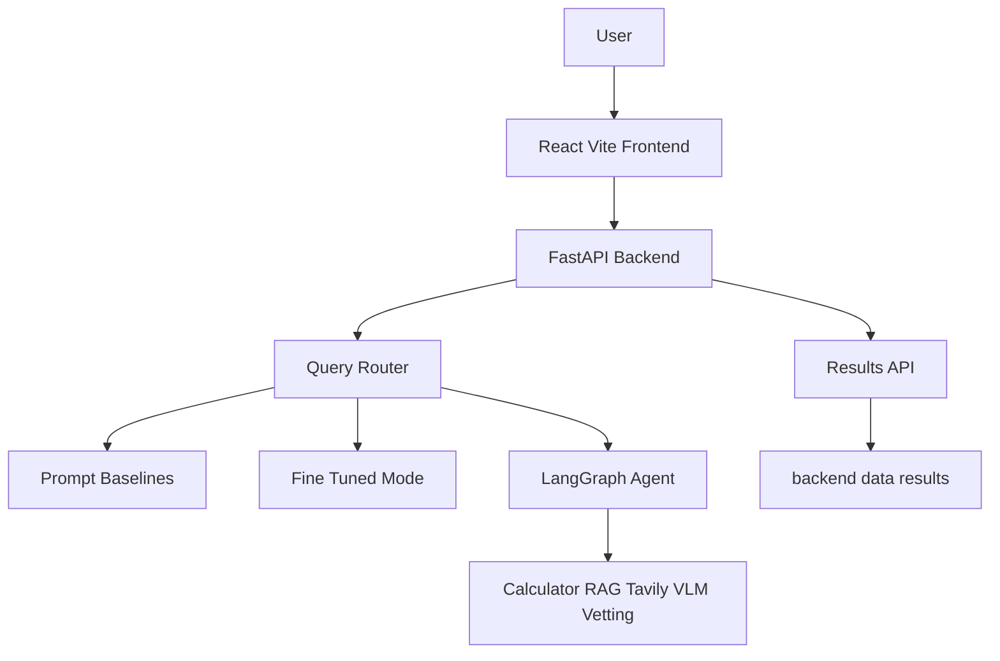

# PeptiScout AI

PeptiScout AI is an academic LLM/VLM-driven research assistant for peptide-related questions. It compares prompt-only GPT baselines, lightweight fine-tuning workflows, and a LangGraph tool-based agent on a custom 100-question benchmark.

The system can produce structured research briefs with:

- peptide protocol and reconstitution guidance
- mechanism-of-action summaries
- benefits, risks, contraindications, and safety notes
- PubMed-style citation audit trails
- optional vendor/source vetting
- optional bloodwork image analysis

This is a research and education prototype. It is not medical advice, does not prescribe treatment, and should not be used as a substitute for qualified clinical guidance.

## Repository Contents

```text
backend/
  agent/                 LangGraph full-agent workflow
  data/                  benchmark, saved metrics, and local datasets
  notebooks/             fine-tuning and final notebook artifacts
  routers/               FastAPI routes for query, tools, and results
  scripts/               dataset generation and evaluation scripts
  tools/                 calculator, RAG, VLM, dosing research, source vetting
frontend/
  src/                   React + Vite application
PROJECT_REPORT.md        full local project report and architecture diagrams
```

## Architecture



Full-agent flow:

```mermaid
flowchart LR
  Router[router] --> ProactiveCheck[proactive_check]
  ProactiveCheck --> DoseRag[dose_rag]
  DoseRag --> DoseTavily[dose_tavily]
  DoseTavily --> DoseExtractor[dose_extractor]
  DoseExtractor --> Calculator[calculator]
  Calculator --> RagRetriever[rag_retriever]
  RagRetriever --> VlmAnalyzer[vlm_analyzer]
  VlmAnalyzer --> SourceVetter[source_vetter]
  SourceVetter --> Synthesizer[synthesizer]
```



## Requirements

- Python 3.11+
- Node.js 18+
- npm
- API keys for full functionality:
  - OpenAI
  - Pinecone
  - Tavily
  - NCBI email for PubMed dataset fetching

Some fine-tuned/local Llama paths require GPU/CUDA-compatible dependencies and are intended for Colab or a GPU machine.

## Environment Setup

Copy the example environment file:

```bash
cp .env.example .env
```

Then fill in the values you need:

```bash
OPENAI_API_KEY=your_key_here
PINECONE_API_KEY=your_key_here
PINECONE_INDEX_NAME=peptiscout
TAVILY_API_KEY=your_key_here
NCBI_EMAIL=your_email_here
LORA_ADAPTER_PATH=
```

Do not commit `.env`. It is ignored by Git.

## Run the Backend Locally

From the repository root:

```bash
python3 -m venv .venv
source .venv/bin/activate
pip install -r backend/requirements.txt
python -m uvicorn backend.main:app --host 127.0.0.1 --port 8000 --reload
```

Health check:

```bash
curl http://127.0.0.1:8000/api/health
```

Expected response:

```json
{"status":"ok"}
```

## Run the Frontend Locally

In a second terminal:

```bash
cd frontend
npm install
npm run dev
```

Open the app:

```text
http://127.0.0.1:5173
```

The frontend calls the backend at `http://127.0.0.1:8000` by default. To override it, set `VITE_API_URL` before starting Vite.

## Main API Modes

`POST /api/query` supports these local modes:

- `baseline-zero-shot`
- `baseline-few-shot`
- `baseline-cot`
- `fine-tuned`
- `fine-tuned-no-rag`
- `full-agent`
- `full-agent-no-calculator`
- `no-reasoning`
- `rag-only-no-finetune`

Example request:

```bash
curl -X POST http://127.0.0.1:8000/api/query \
  -H "Content-Type: application/json" \
  -d '{
    "text": "I have a 5mg vial of BPC-157 for tendon healing. How much BAC water should I use?",
    "mode": "full-agent",
    "image_base64": null,
    "image_type": null
  }'
```

Responses are normalized to:

```json
{
  "protocol": "...",
  "moa": "...",
  "good_bad": "...",
  "audit_trail": "...",
  "react_trace": "..."
}
```

## Tool Endpoints

The backend also exposes direct tool routes:

- `POST /api/calculate` for deterministic reconstitution math
- `POST /api/rag` for Pinecone PubMed retrieval
- `POST /api/analyze-bloodwork` for VLM biomarker extraction
- `POST /api/vetting` for vendor/source vetting
- `GET /api/results` for saved evaluation metrics

## Evaluation

The local benchmark is `backend/data/benchmark_100.json`.

Benchmark composition:

- 40 dosage/reconstitution questions
- 30 mechanism/cofactor questions
- 20 safety questions
- 10 vendor/source-vetting questions

Run a quick smoke test while the backend is running:

```bash
python -m backend.scripts.run_evaluation --limit 2 --skip-ca
```

Run the full local evaluation:

```bash
python -m backend.scripts.run_evaluation
```

This writes:

```text
backend/data/results.json
backend/data/eval_checkpoint.json
```

Metrics used:

- `DS`: dosage score
- `DS strict`: stricter dosage score requiring both dose and water range match
- `PC`: pathway/cofactor completeness
- `TSR`: task success rate for safety plus guidance language
- `CA`: citation accuracy through PMID validation

See `PROJECT_REPORT.md` for the complete report, metric definitions, saved GPT results, ablations, limitations, and architecture diagrams.

## Dataset and Fine-Tuning

The local dataset pipeline is:

```bash
python -m backend.scripts.generate_dataset --phase fetch
python -m backend.scripts.generate_dataset --phase alpaca --resume
python -m backend.scripts.generate_dataset --phase pinecone
```

The pipeline:

1. Fetches PubMed abstracts for configured peptides.
2. Uses a GPT teacher model to create Alpaca instruction pairs.
3. Stores local training rows in `backend/data/peptide_dataset.json`.
4. Chunks and embeds abstracts into Pinecone for RAG.

Fine-tuning notebooks live in `backend/notebooks/`. The local API has fine-tuned modes, but they require a compatible LoRA adapter and GPU/CUDA-compatible inference dependencies.

## GitHub Safety Checklist

Before pushing publicly:

- Make sure `.env` is not staged.
- Keep `.env.example` as placeholders only.
- Do not commit model adapter weights under `backend/models/`.
- Review notebooks for accidental secrets in outputs.
- Consider whether large generated files should be committed or stored elsewhere.
- Run `git status --short` and inspect all untracked files before committing.

Useful commands:

```bash
git status --short
git check-ignore -v .env
```


